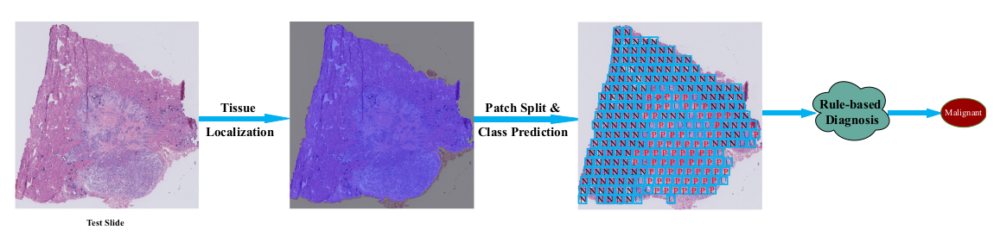

# Rule-based Automatic Diagnosis of Thyroid Nodules from Intraoperative Frozen Sections using Deep Learning
Frozen sections provide a basis for rapid intraoperative diagnosis that can guide surgery, but the diagnoses often challenge pathologists. Here we propose a rule-based system to differentiate thyroid nodules from intraoperative frozen sections using deep learning techniques. The proposed system consists of three components: (1) automatically locating tissue regions in the whole slide images (WSIs), (2) splitting located tissue regions into patches and classifying each patch into predefined categories using convolutional neural networks (CNN), and (3) integrating predictions of all patches to form the final diagnosis with a rule-based system. The simple flow chart of the proposed system is shown as below:

